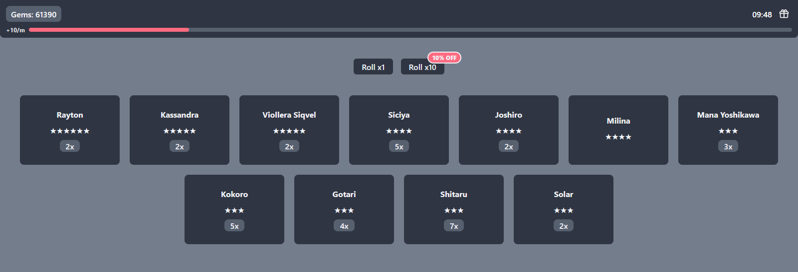

<br>
<h1 align="center">✨<b>Gacha Simulator</b>✨</h1>

<br>


<br>
<div align="center">


</div>

## 🎮 Gacha Simulator
This is a simple gacha game. Here you can roll characters  by spending 💎 **Gacha Gems**.

<br>

### 🎰 There is small info about rolls:
---
<br>

- One Roll Costs ` 130 ` Gacha Gems
- There is **10% Sale** on 10x Roll 
- You can get Gacha Gems when you ⏱️ **Offline**!

<br>

### ⌨️ How to build App:
---
<br>

Firstly you need to install [Node.js](https://nodejs.org/en/)

Be sure that you install [Framer Motion](https://www.framer.com/motion/) and [React](https://reactjs.org/) I use [Vite](https://vitejs.dev/)

Then:
```console
$ git clone https://github.com/PoweredDeveloper/GachaSimulator.git
$ cd ./GachaSimulator/
$ npm i
$ npm run dev
```
<br>

### 🧐 List of Characters Here:
---
<br>

+ **6** ★ **|** - *Scissors* 
- **5** ★ **|** - *Laccelott*
+ **5** ★ **|** - *Viollera Siqvel*
- **5** ★ **|** - *Kassandra*
+ **4** ★ **|** - *Siciya*
- **3** ★ **|** - *Solar*

<br>

Check This [data.js](https://github.com/PoweredDeveloper/GachaSimulator/blob/main/src/assets/data/data.js) for more info.

<br>

*📃 Readme will be updating soon...*
<br>